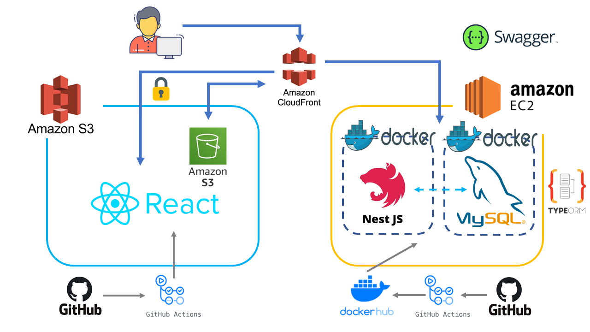
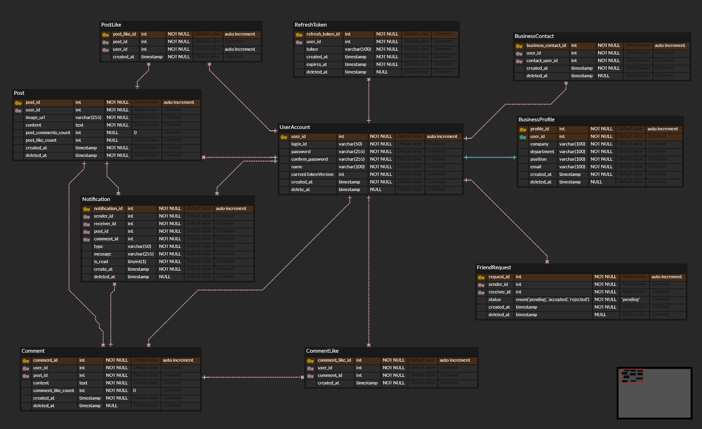

#  SNS

## 🎯기획 의도
명함을 주고받은 이후에 비즈니스 목적이 없으면 연락을 하지 않게 됩니다.
비즈니스 외에도 연결고리를 만들 수 있다면 비즈니스 목적 없는 좋은 만남을 만들어나갈 수 있다고 생각하여
본 서비스를 기획하였습니다.

## 🔑주요 기능

1. **회원가입 및 비즈니스 정보 수집**  
   - 회원가입 시 회사명, 직책, 연락처 등의 비즈니스 정보를 입력하여 개인 명함을 생성합니다.

2. **인맥 관리**  
   - 아이디를 통해 인맥을 추가하고, 추가된 인맥의 비즈니스 정보를 확인할 수 있습니다.
   - 인맥 리스트에서 특정 유저를 클릭하면 해당 유저의 명함 정보와 피드를 함께 볼 수 있습니다.

3. **게시물 피드**  
   - 메인 피드 페이지에서는 본인의 게시물뿐만 아니라 나와 인맥들이 작성한 모든 게시물이 표시됩니다.
   - 게시물에 좋아요를 누르거나 댓글을 작성할 수 있습니다.

4. **알림 기능**  
   - 30초마다 새로운 알림을 조회하여 게시물에 대한 좋아요, 댓글, 친구 요청 등을 확인할 수 있습니다.

5. **유저 정보 수정**  
   - 유저는 자신의 비즈니스 프로필 및 계정 정보를 수정할 수 있으며, 비밀번호 변경 기능을 제공합니다.
## 인프라 아키텍처

## 💻기술 스택
- **프론트엔드**:  
  
  
  
  

- **백엔드**:  

## 🛠️개발 과정

클릭하여 작업 과정을 확인하세요

수정중!

## 역할 분담

### 강용제
- 프로젝트 기획 및 와이어프레임 설계
- 프론트엔드 개발 (React)

### 김도연
- 백엔드 개발 (NestJS, MySQL, TypeORM, Jest)
- 인프라(AWS, Docker, CloudFront, GitHub Actions)

## 📅개발 기간
- **2024년 9월 15일 ~ 12월 15일 (3달)**

## ℹ️ 사용 버전
- **React**: `v18.3.1`
- **React-Router-DOM**: `v6.26.2`
- **Redux Toolkit**: `v2.2.7`
- **TypeScript**: `v5.5.3`
- **Vite**: `v5.4.1`
- **Node.js**: `v20.15.0`
- **NestJS**: `v10.0.0`
- **MySQL**: `v8.0.39`
- **TypeORM**: `v0.3.20`

## 📚Swagger UI
http://3.36.153.140:3000/api-docs

## 🗄️ERD 설계도

