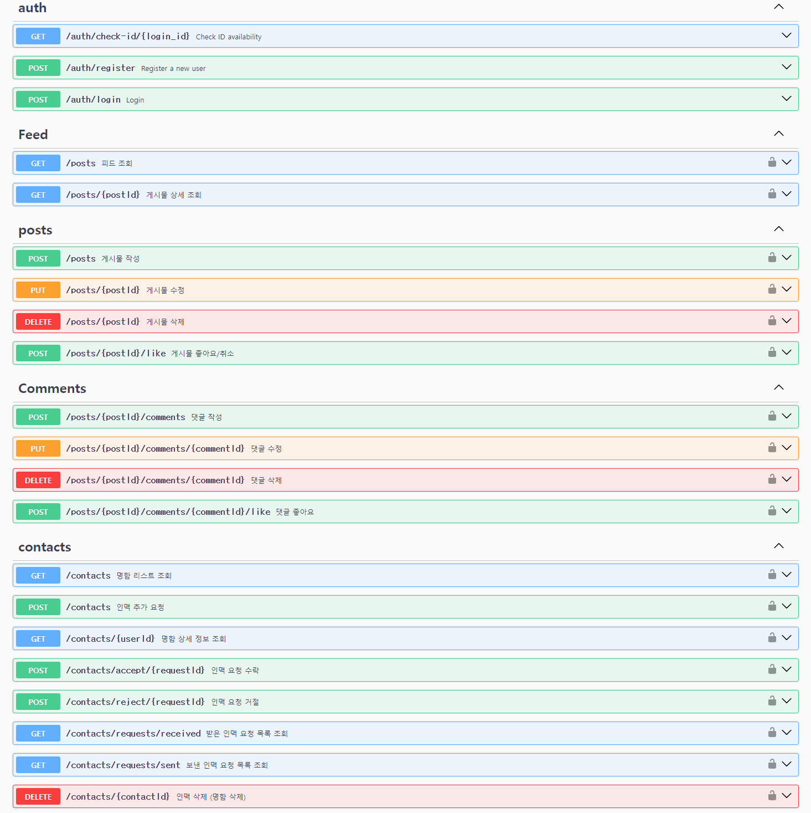

# 비즈니스 인맥을 위한 sns 프로젝트

### 기획 의도
명함을 주고받은 이후에 비즈니스 목적이 없으면 연락을 하지 않게 됩니다.
비즈니스 외에도 연결고리를 만들 수 있다면 비즈니스 목적 없는 좋은 만남을 만들어나갈 수 있다고 생각하여
본 서비스를 기획하였습니다.

### 주요 기능
- 회원가입시 비즈니스 정보(회사명, 직책, 연락처 등)를 수집합니다.
- 아이디를 통해 인맥을 추가하여 인맥의 비즈니스 정보를 확인할 수 있습니다.
- 게시물 피드를 통해 추가한 인맥들의 다양한 소식을 확인하고, 소통할 수 있습니다.

### 기술 스택
- **프론트엔드**:  
  
  
  
  

- **백엔드**:  
  
  
  
  
  
  

- **배포**:  

  

### 역할 분담
**김도연** : 백엔드, 프론트엔드, 배포

**강용제** : 프론트엔드, 기획

### 개발 기간
- **2024년 9월 15일 ~ 10월 8일 (24일)**

### 사용 버전
- **React**: `v18.3.1`
- **React-Router-DOM**: `v6.26.2`
- **Redux Toolkit**: `v2.2.7`
- **TypeScript**: `v5.5.3`
- **Vite**: `v5.4.1`
- **Node.js**: `v20.15.0`
- **NestJS**: `v10.0.0`
- **MySQL**: `v8.0.39`
- **TypeORM**: `v0.3.20`

### 프로젝트 구조
<details>
<summary>프론트엔드</summary>
  
```bash
Devlntro_front/
│
│
├── src/
│   ├── api/
│   │   ├── axiosInstance.ts
│   │   └── useAuthRedirect.ts
│   │
│   ├── assets/
│   │   └── react.svg
│   │
│   ├── components/
│   │   ├── FeedDetail.tsx
│   │   ├── NavBar.tsx
│   │   ├── PasswordChange.tsx
│   │   └── ProtectedRoute.tsx
│   │
│   ├── contexts/
│   │   └── AuthContext.tsx
│   │
│   ├── pages/
│   │   ├── CreatePostPage.tsx
│   │   ├── FeedPage.tsx
│   │   ├── FriendsFeedPage.tsx
│   │   ├── FriendsPage.tsx
│   │   ├── LoginPage.tsx
│   │   ├── MyPage.tsx
│   │   └── SignUpPage.tsx
│   │
│   ├── redux/
│   │   ├── store.ts
│   │   ├── userSlice.ts
│   │   └── notificationSlice.ts
│   │
│   ├── App.css
│   ├── App.tsx
│   ├── index.css
│   └── main.tsx
│
├── .env.development
├── .env.production
├── .eslintrc.cjs
├── .gitignore
├── index.html
├── package-lock.json
├── package.json
├── README.md
├── tsconfig.json
├── tsconfig.node.json
└── vite.config.ts

```

- `src/`: 소스 코드를 포함하는 메인 디렉토리
  - `api/`: API 관련 설정 및 인스턴스
  - `assets/`: 이미지 등의 정적 자원
  - `components/`: 재사용 가능한 React 컴포넌트
  - `contexts/`: React Context API를 사용한 상태 관리
  - `pages/`: 각 페이지를 나타내는 컴포넌트
  - `redux/`: Redux 관련 파일 (스토어 설정, 슬라이스 등)
- `.env.development` 및 `.env.production`: 개발 및 프로덕션 환경 변수 설정
- `vite.config.ts`: Vite 설정 파일
- `package.json`: 프로젝트 의존성 및 스크립트 정의
</details>

<details>
<summary>백엔드</summary>
  
```bash
Devlntro_api/
│
├── src/
│   ├── auth/
│   │   ├── auth.controller.ts
│   │   ├── auth.module.ts
│   │   ├── auth.service.ts
│   │   ├── auth.controller.spec.ts
│   │   ├── auth.service.spec.ts
│   │   ├── jwt-auth.guard.ts
│   │   ├── jwt.strategy.ts
│   │   └── dto/
│   │       ├── comment.dto.ts
│   │
│   ├── comment/
│   │   ├── comment.controller.ts
│   │   ├── comment.module.ts
│   │   ├── comment.service.ts
│   │   └── dto/
│   │       ├── comment.dto.ts
│   │
│   ├── common/
│   ├── contacts/
│   │   ├── contacts.controller.ts
│   │   ├── contacts.module.ts
│   │   ├── contacts.service.ts
│   │   └── dto/
│   │       ├── create-contact.dto.ts
│   │
│   ├── controllers/
│   │   └── sample.controller.ts
│   ├── dto/
│   │   ├── feed-query.dto.ts
│   │   ├── sample.dto.ts
│   ├── entities/
│   │   ├── business-contact.entity.ts
│   │   ├── business-profile.entity.ts
│   │   ├── comment-like.entity.ts
│   │   ├── comment.entity.ts
│   │   ├── friend-request.entity.ts
│   │   ├── notification.entity.ts
│   │   ├── post-like.entity.ts
│   │   ├── post.entity.ts
│   │   └── user-account.entity.ts
│   ├── feed/
│   │   ├── feed.controller.ts
│   │   ├── feed.module.ts
│   │   ├── feed.service.ts
│   ├── migrations/
│   │   ├── 1726495772853-InitialMigration.ts
│   │   ├── 1726674158617-RenameLikes.ts
│   │   ├── 1726743763543-AddDeletedAtToPost.ts
│   │   ├── 1726757374843-AddDeletedAtToUser.ts
│   │   ├── 1726844599137-AddConfirmPassword.ts
│   │   ├── 1727088144419-CreateFriendRequest.ts
│   │   ├── 1727102625007-AddDeleteAtToNotification.ts
│   │   ├── 1727185582581-UpdateRemainingTokens.ts
│   │   ├── 1727956898358-CreateNotificationEntity.ts
│   │   ├── 1727963072309-AddPostIdAndUserIdToPost.ts
│   │   └── 1728369960382-AddDeletedAtToPostLike.ts
│   ├── notification/
│   │   ├── notifications.controller.ts
│   │   ├── notifications.module.ts
│   │   ├── notifications.service.ts
│   ├── post/
│   │   ├── post.controller.ts
│   │   ├── post.module.ts
│   │   ├── post.service.ts
│   │   └── dto/
│   │       ├── post.dto.ts
│   ├── s3/
│   │   └── s3.module.ts
│   ├── seeds/
│   │   └── initial-data.seed.ts
│   ├── services/
│   │   ├── feed-filter.service.ts
│   │   ├── sorting-service.ts
│   ├── user/
│   │   ├── dto/
│   │   ├── user.controller.ts
│   │   ├── user.module.ts
│   │   ├── user.service.ts
│   ├── app.controller.spec.ts
│   ├── app.controller.ts
│   ├── app.module.ts
│   ├── app.service.ts
│   ├── main.ts
│   └── ormconfig.ts
├── test/
├── .dockerignore
├── .env
├── .eslintrc.js
├── .gitignore
├── .prettierrc
├── Dockerfile
├── nest-cli.json
├── package-lock.json
├── package.json
└── README.md
```
- `src`: 메인 소스 코드 디렉토리
- `auth`: 인증 관련 모듈, 컨트롤러, 서비스
- `users`: 사용자 관리 관련 모듈, 컨트롤러, 서비스, DTO
- `posts`: 게시물 관리 관련 모듈, 컨트롤러, 서비스, DTO
- `comments`: 댓글 관리 관련 모듈, 컨트롤러, 서비스, DTO
- `contacts`: 인맥 관리 관련 모듈, 컨트롤러, 서비스, DTO
- `feed`: 사용자 피드 관련 기능, 모듈, 서비스
- `notifications`: 알림 관련 모듈, 컨트롤러, 서비스
- `s3`: S3 관련 파일 업로드 모듈
- `migrations`: 데이터베이스 마이그레이션 파일들
- `seeds`: 데이터베이스 초기 데이터를 위한 시드 파일
- `services`: 여러 기능에 대한 서비스 레이어 코드
  - `feed-filter.service.ts`: 피드 필터링 로직을 처리하는 서비스
  - `sorting-service.ts`: 정렬 로직을 처리하는 서비스
- `database`: 데이터베이스 연결 설정 모듈
- `common`: 공통으로 사용되는 필터, 파이프라인 등
- `config`: 환경 설정 관련 파일
- `controllers`: 기타 컨트롤러 코드 모음
- `dto`: 공통 데이터 전송 객체 (DTO) 모음
- `entities`: 데이터베이스 엔티티 정의
  - `post.entity.ts`: 게시물 관련 엔티티 정의
  - `comment.entity.ts`: 댓글 관련 엔티티 정의
  - `user-account.entity.ts`: 사용자 계정 관련 엔티티 정의
  - `notification.entity.ts`: 알림 관련 엔티티 정의
- `main.ts`: 백엔드 애플리케이션의 진입점
- `.env`: 환경 변수 파일
- `.dockerignore`: Docker 관련 불필요 파일 제외
- `Dockerfile`: Docker 설정 파일
- `.eslintrc.js`: ESLint 설정 파일
- `.prettierrc`: Prettier 설정 파일
- `ormconfig.ts`: TypeORM 설정 파일
- `package.json`: 프로젝트 의존성 및 스크립트 정의
- `tsconfig.json`: TypeScript 설정 파일
- `README.md`: 프로젝트 설명 문서


</details>

### Swagger UI


### ERD 설계도


### API 명세서
<details>
<summary>API 명세서 펼치기/접기</summary>

## 1. 인증 및 사용자 관리
<details>
<summary>1.1 아이디 중복 검사</summary>

- **엔드포인트**: GET /auth/check-id/{login_id}
- **응답**:
    - 사용 **가능** (200 OK):
        
        ```json
        {
          "statusCode": 200,
          "message": "사용 가능한 아이디입니다."
        }
        ```
        
    - 사용 **불가** (200 OK):
        
        ```json
        {
          "statusCode": 200,
          "message": "이미 사용 중인 아이디입니다."
        }
        ```
</details>        

<details>
<summary>1.2 회원가입</summary>

- **엔드포인트**: POST /auth/register
- **요청 본문**:
    
    ```json
    {
      "login_id": "String",
      "password": "String",
      "confirmPassword": "String",
      "name": "String",
      "company": "String",
      "department": "String",
      "position": "String",
      "email": "String",
      "phone": "String"
    }
    ```
    
- **응답**:
    - **성공** (201 OK):
        
        ```json
        {
          "statusCode": 201,
          "message": "회원가입이 성공적으로 완료되었습니다.",
          "userId": "Number"
        }
        ```
        
    
    - **아이디 중복** (400 Bad Request):
        
        ```json
        {
          "statusCode": 400,
          "message": "이미 존재하는 아이디입니다.",
          "error": "Bad Request"
        }
        ```
        
    - **비밀번호 불일치** (400 Bad Request)
    - **서버 내부 에러**
        
        ```json
        {
          "statusCode": 400,
          "message": "비밀번호와 확인 비밀번호가 일치하지 않습니다.",
          "error": "Bad Request"
        }
        ```
</details>        

<details>
<summary>1.3 로그인</summary>

- **엔드포인트**: POST /auth/login
- **요청 본문**:
    
    ```json
    {
      "login_id": "String",
      "password": "String"
    }
    
    ```
    
- **응답**:
    - 성공 (200 OK):
        
        ```json
        {
          "statusCode": 200,
          "message": "로그인 성공",
          "token": "JWT_TOKEN",
          "userId": "Number"
        }
        
        ```
        
    - 실패 (401 Unauthorized):
        
        ```json
        {
          "statusCode": 401,
          "message": "아이디 또는 비밀번호가 잘못되었습니다.",
          "error": "Unauthorized"
        }
        ```
</details>        

## 2. 게시물 조회 (통합 엔드포인트)

<details>
<summary>2.1 피드 조회 (메인 페이지, 내 게시물, 특정 유저 게시물 조회)</summary>

- **엔드포인트**: `GET /posts`
- **헤더**: `Authorization: Bearer {JWT_TOKEN}`
- **쿼리 파라미터**:
    - `sort`: `"latest"`, `"likes"`, `"comments"` (정렬 기준 선택, 기본값은 `"latest"`)
    - `filter`: `"all"`, `"own"`, `"specific"` (게시물 필터링)
    - `specificUserId`: 특정 유저 게시물 조회 시 필요한 유저 ID

### **요청 예시**:

- **메인 페이지 (본인 + 인맥 게시물)**:
    
    ```sql
    GET /posts?filter=all&sort=latest
    ```
    
- **내 게시물 조회 (마이 게시물)**:
    
    ```bash
    GET /posts?filter=own&sort=latest
    ```
    
- **특정 유저 페이지 (특정 유저 게시물)**:
    
    ```sql
    GET /posts?filter=specific&specificUserId=123&sort=comments
    ```
    

### **응답 예시**:

### 성공 (200 OK):

```json
{
  "statusCode": 200,
  "message": "피드를 성공적으로 조회했습니다.",
  "posts": [
    {
      "postId": 123,
      "createrId": 456,
      "createrName": "홍길동",
      "createdAt": "2024-09-18T12:34:56.000Z",
      "imageUrl": "https://example.com/image.jpg",
      "isOwnPost": true},
    {
      "postId": 124,
      "createrId": 789,
      "createrName": "김철수",
      "createdAt": "2024-09-18T13:00:00.000Z",
      "imageUrl": "https://example.com/image2.jpg",
      "isOwnPost": false}
  ]
}
```

### 잘못된 파라미터 (400 Bad Request):

```json
{
  "statusCode": 400,
  "message": "잘못된 요청입니다. specificUserId가 필요합니다.",
  "error": "Bad Request"
}
```

### 게시물 없음 (404 Not Found):

```json
{
  "statusCode": 404,
  "message": "해당 게시물을 찾을 수 없습니다.",
  "error": "Not Found"
}
```

---
</details>

<details>
<summary>2.2 게시물 상세 조회</summary>

- **엔드포인트**: `GET /posts/{postId}`
- **헤더**: `Authorization: Bearer {JWT_TOKEN}`

### **응답 예시**:

### 성공 (200 OK):

```json
{
  "statusCode": 200,
  "message": "게시물을 성공적으로 조회했습니다.",
  "postId": 123,
  "createrId": 456,
  "createrName": "홍길동",
  "createdAt": "2024-09-18T12:34:56.000Z",
  "imageUrl": "https://example.com/image.jpg",
  "content": "이 게시물의 내용입니다.",
  "likesCount": 42,
  "commentsCount": 10,
  "isOwnPost": true,
  "comments": [
    {
      "commentId": 1,
      "authorName": "김철수",
      "content": "멋진 게시물이네요!",
      "createdAt": "2024-09-18T12:45:00.000Z"
    },
    {
      "commentId": 2,
      "authorName": "이영희",
      "content": "좋은 글 감사합니다.",
      "createdAt": "2024-09-18T13:00:00.000Z"
      "likeCount": "2"
    }
  ],
  "likes": [
    {
      "userId": 789,
      "userName": "김철수"
    },
    {
      "userId": 890,
      "userName": "이영희"
    }
  ]
}
```

### 유효하지 않은 게시물 ID (400 Bad Request):

```json
{
  "statusCode": 400,
  "message": "유효하지 않은 게시물 ID입니다.",
  "error": "Bad Request"
}
```

### 게시물 없음 (404 Not Found):

```json
{
  "statusCode": 404,
  "message": "해당 게시물을 찾을 수 없습니다.",
  "error": "Not Found"
}
```
</details>

## 3. 게시물 관리

<details>
<summary>3.1 게시물 작성</summary>

- **엔드포인트**: POST /posts
- **헤더**: Authorization: Bearer {JWT_TOKEN}
- **요청 본문**:
    - **Form Data**:
        - `content`: String (필수) - 게시물 내용
        - `image`: File (선택) - 업로드할 이미지 파일
- **응답**:
    - **성공** (201 Created):
        
        ```json
        {
          "statusCode": 201,
          "message": "게시물이 성공적으로 작성되었습니다.",
          "postId": "Number"
        }
        ```
        
    - **실패** (400 Bad Request):
        
        ```json
        {
          "statusCode": 400,
          "message": "게시물 작성에 실패했습니다. 필수 필드를 확인해주세요.",
          "error": "Bad Request"
        }
        ```
</details>        

<details>
<summary>3.2 게시물 수정</summary>

- **엔드포인트**: PUT /posts/{postId}
- **헤더**: Authorization: Bearer {JWT_TOKEN}
- **요청 본문**:
    - **Form Data**:
        - `content`: String (선택) - 게시물 내용
        - `image`: File (선택) - 새로 업로드할 이미지 파일
- **응답**:
    - **성공** (200 OK):
        
        ```json
        {
          "statusCode": 200,
          "message": "게시물이 성공적으로 수정되었습니다."
        }
        ```
        
    - **실패** (400 Bad Request):
        
        ```json
        {
          "statusCode": 400,
          "message": "게시물 수정에 실패했습니다. 유효한 데이터를 입력해주세요.",
          "error": "Bad Request"
        }
        ```
        
    - **실패** (404 Not Found):
        
        ```json
        {
          "statusCode": 404,
          "message": "게시물을 찾을 수 없습니다.",
          "error": "Not Found"
        }
        
        ```
</details>        

<details>
<summary>3.3 게시물 삭제</summary>

- **엔드포인트**: DELETE /posts/{postId}
- **헤더**: Authorization: Bearer {JWT_TOKEN}
- **응답**:
    - **성공** (200 OK):
        
        ```json
        {
          "statusCode": 200,
          "message": "게시물이 성공적으로 삭제되었습니다."
        }
        ```
        
    - **실패** (404 Not Found):
        
        ```json
        {
          "statusCode": 404,
          "message": "게시물을 찾을 수 없습니다.",
          "error": "Not Found"
        }
        ```
</details>        

<details>
<summary>3.4 게시물 좋아요</summary>

- **엔드포인트**: POST /posts/{postId}/like
- **헤더**: Authorization: Bearer {JWT_TOKEN}
- **응답**:
    - **성공** (200 OK):
        
        ```json
        {
          "statusCode": 200,
          "message": "게시물에 좋아요를 눌렀습니다.",
          "likeCount": "Number"
        }
        ```
        
    - **성공** (200 OK) - 좋아요 취소:
        
        ```json
        {
          "statusCode": 200,
          "message": "게시물 좋아요를 취소했습니다.",
          "likeCount": "Number"
        }
        ```
        
    - **실패** (404 Not Found):
        
        ```json
        {
          "statusCode": 404,
          "message": "게시물을 찾을 수 없습니다.",
          "error": "Not Found"
        }
        ```
 </details>       

## 4. 댓글관리

<details>
<summary>댓글 작성</summary>

- **엔드포인트**: POST /posts/{postId}/comments
- **헤더**: Authorization: Bearer {JWT_TOKEN}
- **요청 본문**:
    
    ```json
    {
      "content": "String"
    }
    ```
    
- **응답**:
    - **성공** (201 Created):
        
        ```json
        {
          "statusCode": 201,
          "message": "댓글이 성공적으로 작성되었습니다.",
          "commentId": "Number"
        }
        ```
        
    - **실패** (400 Bad Request):
        
        ```json
        {
          "statusCode": 400,
          "message": "댓글 작성에 실패했습니다. 내용을 입력해주세요.",
          "error": "Bad Request"
        }
        ```
</details>        

<details>
<summary>댓글 수정</summary>

- **엔드포인트**: PUT /posts/{postId}/comments/{commentId}
- **헤더**: Authorization: Bearer {JWT_TOKEN}
- **요청 본문**:
    
    ```json
    {
      "content": "String"
    }
    ```
    

**응답**

- **성공** (200 OK):
    
    ```json
    {
      "statusCode": 200,
      "message": "댓글이 성공적으로 수정되었습니다."
    }
    ```
    
- **실패** (400 Bad Request):
    
    ```json
    {
      "statusCode": 400,
      "message": "댓글 수정에 실패했습니다. 유효한 내용을 입력해주세요.",
      "error": "Bad Request"
    }
    ```
    
- **실패** (404 Not Found):
    
    ```json
    {
      "statusCode": 404,
      "message": "댓글을 찾을 수 없습니다.",
      "error": "Not Found"
    }
    ```
</details>     

<details>
<summary>댓글 삭제</summary>

- **엔드포인트**: DELETE /posts/{postId}/comments/{commentId}
- **헤더**: Authorization: Bearer {JWT_TOKEN}
- **응답**:
    - **성공** (200 OK):
        
        ```json
        {
          "statusCode": 200,
          "message": "댓글이 성공적으로 삭제되었습니다."
        }
        ```
        
    - **실패** (404 Not Found):
        
        ```json
        {
          "statusCode": 404,
          "message": "댓글을 찾을 수 없습니다.",
          "error": "Not Found"
        }
        ```
</details>

<details>
<summary>댓글 좋아요</summary>

- **엔드포인트**: POST /posts/{postId}/comments/{commentId}/like
- **헤더**: Authorization: Bearer {JWT_TOKEN}
- **응답**:
    - **성공** (200 OK) - 좋아요 추가:
        
        ```json
        {
          "statusCode": 200,
          "message": "댓글에 좋아요를 눌렀습니다.",
          "likeCount": "Number"
        }
        ```
        
    - **성공** (200 OK) - 좋아요 취소:
        
        ```json
        {
          "statusCode": 200,
          "message": "댓글 좋아요를 취소했습니다.",
          "likeCount": "Number"
        }
        ```
        
    - **실패** (404 Not Found):
        
        ```json
        {
          "statusCode": 404,
          "message": "댓글을 찾을 수 없습니다.",
          "error": "Not Found"
        }

        ```
</details>        

## 5. 명함 관리

<details>
<summary>5.1 명함 리스트 조회</summary>

- **엔드포인트**: GET /contacts
- **헤더**: `Authorization: Bearer {JWT_TOKEN}`
- **응답**:
    - 성공 (200 OK):
        
        ```json
        {
          "statusCode": 200,
          "message": "명함 리스트를 성공적으로 조회했습니다.",
          "contacts": [
            {
              "userId": "Number",
              "name": "String",
              "company": "String",
              "department": "String"
            }
          ]
        }
        ```
        
    - 실패 (400 Bad Request):
        
        ```json
        {
          "statusCode": 400,
          "message": "잘못된 요청입니다.",
          "error": "Bad Request"
        }
        ```
        
    - 실패 (404 Not Found):
        
        ```json
        {
          "statusCode": 404,
          "message": "명함 리스트를 찾을 수 없습니다.",
          "error": "Not Found"
        }
        ```
</details>        

<details>
<summary>5.2 명함 상세 정보 조회</summary>

- **엔드포인트**: GET /contacts/{userId}
- **헤더**: `Authorization: Bearer {JWT_TOKEN}`
- **응답**:
    - 성공 (200 OK):
        
        ```json
        {
          "statusCode": 200,
          "message": "명함 상세 정보를 성공적으로 조회했습니다.",
          "contact": {
            "userId": "Number",
            "name": "String",
            "company": "String",
            "department": "String",
            "position": "String",
            "email": "String",
            "phone": "String"
          }
        }
        ```
        
    - 실패 (400 Bad Request):
        
        ```json
        {
          "statusCode": 400,
          "message": "유효하지 않은 사용자 ID입니다.",
          "error": "Bad Request"
        }
        ```
        
    - 실패 (404 Not Found):
        
        ```json
        {
          "statusCode": 404,
          "message": "해당 사용자의 명함을 찾을 수 없습니다.",
          "error": "Not Found"
        }
        ```
</details>        

<details>
<summary>5.3 인맥 추가 (명함 추가)</summary>

- **엔드포인트**: POST /contacts
- **헤더**: `Authorization: Bearer {JWT_TOKEN}`
- **요청 본문**:
    
    ```json
    {
      "loginId": "Number"
    }
    ```
    
- **응답**:
    - 성공 (201 Created):
        
        ```json
        {
          "statusCode": 201,
          "message": "인맥이 요청이 성공적으로 추가되었습니다.",
          "contactId": "Number"
        }
        ```
        
    - 실패 (400 Bad Request):
        
        ```json
        {
          "statusCode": 400,
          "message": "대상 사용자를 찾을 수 없습니다.",
          "error": "Bad Request"
        }
        ```
        
    - 실패 (409 Conflict):
        
        ```json
        {
          "statusCode": 409,
          "message": "이미 인맥 요청을 보냈거나 인맥 관계가 존재합니다.",
          "error": "Conflict"
        }
        ```
 </details>        

<details>
<summary>5.4 인맥 요청 수락</summary>

- **엔드포인트**: POST /contacts/accept/{requestId}
- **헤더**: `Authorization: Bearer {JWT_TOKEN}`
- **응답**:
    - 성공 (200 OK):

```json
{
  "statusCode": 200,
  "message": "인맥 요청이 수락되었습니다.",
  "contactId": "Number"// 새로 생성된 인맥 관계의 ID
}
```

- 실패 (400 Bad Request):

```json
{
  "statusCode": 400,
  "message": "유효하지 않은 요청입니다.",
  "error": "Bad Request"
}
```

- 실패 (404 Not Found):

```json
{
  "statusCode": 404,
  "message": "해당 인맥 요청을 찾을 수 없습니다.",
  "error": "Not Found"
}
```
</details>

<details>
<summary>5.5 인맥 요청 거절</summary>

- **엔드포인트**: POST /contacts/reject/{requestId}
- **헤더**: `Authorization: Bearer {JWT_TOKEN}`
- **응답**:
    - 성공 (200 OK):

```json
{
  "statusCode": 200,
  "message": "인맥 요청이 거절되었습니다."
}
```

- 실패 (400 Bad Request):

```json
{
  "statusCode": 400,
  "message": "유효하지 않은 요청입니다.",
  "error": "Bad Request"
}
```

- 실패 (404 Not Found):

```json
{
  "statusCode": 404,
  "message": "해당 인맥 요청을 찾을 수 없습니다.",
  "error": "Not Found"
}
```
</details>

<details>
<summary>5.6 받은 인맥 요청 목록 조회</summary>

- **엔드포인트**: GET /contacts/requests/received
- **헤더**: `Authorization: Bearer {JWT_TOKEN}`
- **응답**:
    - 성공 (200 OK):

```json
{
  "statusCode": 200,
  "message": "받은 인맥 요청 목록을 성공적으로 조회했습니다.",
  "requests": [
    {
      "requestId": "Number",
      "senderLoginId": "String",
      "senderName": "String",
      "requestedAt": "DateTime"
    }
  ]
}
```

- 실패 (400 Bad Request):

```json
{
  "statusCode": 400,
  "message": "요청 처리 중 오류가 발생했습니다.",
  "error": "Bad Request"
}
```
</details>

<details>
<summary>5.7 보낸 인맥 요청 목록 조회</summary>

- **엔드포인트**: GET /contacts/requests/sent
- **헤더**: `Authorization: Bearer {JWT_TOKEN}`
- **응답**:
    - 성공 (200 OK):

```json
{
  "statusCode": 200,
  "message": "보낸 인맥 요청 목록을 성공적으로 조회했습니다.",
  "requests": [
    {
      "requestId": "Number",
      "senderLoginId": "String",
      "senderName": "String",
      "requestedAt": "DateTime"
    }
  ]
}
```

- 실패 (400 Bad Request):

```json
{
  "statusCode": 400,
  "message": "요청 처리 중 오류가 발생했습니다.",
  "error": "Bad Request"
}
```
</details>

<details>
<summary>5.8 인맥 삭제 (명함 삭제)</summary>

- **엔드포인트**: DELETE /contacts/{contactId}
- **헤더**: `Authorization: Bearer {JWT_TOKEN}`
- **응답**:
    - 성공 (200 OK):
        
        ```json
        {
          "statusCode": 200,
          "message": "인맥이 성공적으로 삭제되었습니다."
        }
        ```
        
    - 실패 (400 Bad Request):
        
        ```json
        {
          "statusCode": 400,
          "message": "유효하지 않은 인맥 ID입니다.",
          "error": "Bad Request"
        }
        ```
        
    - 실패 (404 Not Found):
        
        ```json
        {
          "statusCode": 404,
          "message": "해당 인맥을 찾을 수 없습니다.",
          "error": "Not Found"
        }
        ```
</details>        

## 6. 사용자 정보 관리

<details>
<summary>6.1 나의 명함 정보 수정</summary>
  
- **엔드포인트**: PUT /users/businessprofile
- **헤더**: `Authorization: Bearer {JWT_TOKEN}`
- **요청 본문**:
    
    ```json
    {
      "name": "String",
      "company": "String",
      "department": "String",
      "position": "String",
      "email": "String",
      "phone": "String"
    }
    ```
    
- **응답**:
    - 성공 (200 OK):
        
        ```json
        {
          "statusCode": 200,
          "message": "프로필 정보가 성공적으로 수정되었습니다."
        }
        ```
        
    - 실패 (400 Bad Request):
        
        ```json
        {
          "statusCode": 400,
          "message": "잘못된 요청입니다. 유효한 정보를 입력해주세요.",
          "error": "Bad Request"
        }
        ```
</details>         

<details>
<summary>6.2 비밀번호 변경 </summary>

- **엔드포인트**: PUT /users/password
- **헤더**: `Authorization: Bearer {JWT_TOKEN}`
- **요청 본문**:
    
    ```json
    {
      "currentPassword": "String",
      "newPassword": "String",
      "confirmNewPassword": "String"
    }
    ```
    
- **응답**:
    - 성공 (200 OK):
        
        ```json
        {
          "statusCode": 200,
          "message": "비밀번호가 성공적으로 변경되었습니다."
        }
        ```
        
    - 실패 (400 Bad Request):
        
        ```json
        {
          "statusCode": 400,
          "message": "새 비밀번호와 확인 비밀번호가 일치하지 않습니다.",
          "error": "Bad Request"
        }
        ```
        
    - 실패 (401 Unauthorized):
        
        ```json
        {
          "statusCode": 401,
          "message": "현재 비밀번호가 올바르지 않습니다.",
          "error": "Unauthorized"
        }
        ```
</details>        

<details>
<summary>6.3 회원 탈퇴</summary>

- **엔드포인트**: DELETE /users
- **헤더**: `Authorization: Bearer {JWT_TOKEN}`
- **요청 본문**:

```json
{
  "password": "String"
}
```

- **응답**:
    - 성공 (200 OK):

```json
{
  "statusCode": 200,
  "message": "회원 탈퇴가 성공적으로 처리되었습니다."
}
```

- 실패 (400 Bad Request):

```json
{
  "statusCode": 400,
  "message": "회원 탈퇴 처리 중 오류가 발생했습니다.",
  "error": "Bad Request"
}
```

- 실패 (401 Unauthorized):

```json
{
  "statusCode": 401,
  "message": "비밀번호가 올바르지 않습니다.",
  "error": "Unauthorized"
}
```
</details>

## 7. 알림 관리

<details>
<summary>7.1 알림 목록 조회</summary>

### 엔드포인트: `GET /notifications`
- **헤더**: `Authorization: Bearer {JWT_TOKEN}`
- **응답**:
    - **성공** (200 OK):
    
    ```json
    {
      "statusCode": 200,
      "message": "알림 목록을 성공적으로 조회했습니다.",
      "notifications": [
        {
          "notificationId": 1,
          "type": "friend_request",
          "message": "홍길동님이 친구 요청을 보냈습니다.",
          "postId": null,
          "commentId": null,
          "isRead": false,
          "createdAt": "2024-10-03T12:34:56Z",
          "senderId": 99
        }
      ]
    }
    ```
    
    - **실패** (400 Bad Request):
    
    ```json
    {
      "statusCode": 400,
      "message": "알림 조회 중 오류가 발생했습니다.",
      "error": "Bad Request"
    }
    ```

</details>

<details>
<summary>7.2 알림 읽음 처리</summary>

### 엔드포인트: `PATCH /notifications/{notificationId}/read`
- **헤더**: `Authorization: Bearer {JWT_TOKEN}`
- **응답**:
    - **성공** (200 OK):
    
    ```json
    {
      "statusCode": 200,
      "message": "알림이 성공적으로 읽음 처리되었습니다."
    }
    ```
    
    - **실패** (404 Not Found):
    
    ```json
    {
      "statusCode": 404,
      "message": "해당 알림을 찾을 수 없습니다.",
      "error": "Not Found"
    }
    ```

</details>

<details>
<summary>7.3 친구 요청 알림 생성</summary>

### 엔드포인트: `POST /notifications/friend-request`
- **헤더**: `Authorization: Bearer {JWT_TOKEN}`
- **요청 본문**:
    
    ```json
    {
      "receiverId": 99,
      "message": "홍길동님이 친구 요청을 보냈습니다."
    }
    ```
    
- **응답**:
    - **성공** (201 Created):
    
    ```json
    {
      "statusCode": 201,
      "message": "친구 요청 알림이 성공적으로 생성되었습니다.",
      "notificationId": 1
    }
    ```
    
    - **실패** (400 Bad Request):
    
    ```json
    {
      "statusCode": 400,
      "message": "친구 요청 알림 생성 중 오류가 발생했습니다.",
      "error": "Bad Request"
    }
    ```

</details>

<details>
<summary>7.4 게시물 좋아요 알림 생성</summary>

### 엔드포인트: `POST /notifications/like-post`
- **헤더**: `Authorization: Bearer {JWT_TOKEN}`
- **요청 본문**:
    
    ```json
    {
      "postId": 123,
      "receiverId": 456,
      "message": "김철수님이 당신의 게시물에 좋아요를 눌렀습니다."
    }
    ```
    
- **응답**:
    - **성공** (201 Created):
    
    ```json
    {
      "statusCode": 201,
      "message": "게시물 좋아요 알림이 성공적으로 생성되었습니다.",
      "notificationId": 2
    }
    ```
    
    - **실패** (400 Bad Request):
    
    ```json
    {
      "statusCode": 400,
      "message": "게시물 좋아요 알림 생성 중 오류가 발생했습니다.",
      "error": "Bad Request"
    }
    ```

</details>

<details>
<summary>7.5 댓글 알림 생성</summary>

### 엔드포인트: `POST /notifications/comment`
- **헤더**: `Authorization: Bearer {JWT_TOKEN}`
- **요청 본문**:
    
    ```json
    {
      "postId": 123,
      "receiverId": 456,
      "message": "이영희님이 당신의 게시물에 댓글을 남겼습니다."
    }
    ```
    
- **응답**:
    - **성공** (201 Created):
    
    ```json
    {
      "statusCode": 201,
      "message": "댓글 알림이 성공적으로 생성되었습니다.",
      "notificationId": 3
    }
    ```
    
    - **실패** (400 Bad Request):
    
    ```json
    {
      "statusCode": 400,
      "message": "댓글 알림 생성 중 오류가 발생했습니다.",
      "error": "Bad Request"
    }
    ```

</details>

<details>
<summary>7.6 댓글 좋아요 알림 생성</summary>

### 엔드포인트: `POST /notifications/like-comment`
- **헤더**: `Authorization: Bearer {JWT_TOKEN}`
- **요청 본문**:
    
    ```json
    {
      "commentId": 789,
      "receiverId": 456,
      "message": "김철수님이 당신의 댓글에 좋아요를 눌렀습니다."
    }
    ```
    
- **응답**:
    - **성공** (201 Created):
    
    ```json
    {
      "statusCode": 201,
      "message": "댓글 좋아요 알림이 성공적으로 생성되었습니다.",
      "notificationId": 4
    }
    ```
    
    - **실패** (400 Bad Request):
    
    ```json
    {
      "statusCode": 400,
      "message": "댓글 좋아요 알림 생성 중 오류가 발생했습니다.",
      "error": "Bad Request"
    }
    ```

</details>

<details>
<summary>7.7 알림 삭제</summary>

### 엔드포인트: `DELETE /notifications/{notificationId}`
- **헤더**: `Authorization: Bearer {JWT_TOKEN}`
- **설명**: 사용자가 특정 알림을 삭제합니다.
- **응답**:
    - **성공** (200 OK):
    
    ```json
    {
      "statusCode": 200,
      "message": "알림이 성공적으로 삭제되었습니다."
    }
    ```
    
    - **실패** (404 Not Found):
    
    ```json
    {
      "statusCode": 404,
      "message": "해당 알림을 찾을 수 없습니다.",
      "error": "Not Found"
    }
    ```

</details>

<details>
<summary>7.8 알림 일괄 삭제</summary>

### 엔드포인트: `DELETE /notifications`
- **헤더**: `Authorization: Bearer {JWT_TOKEN}`
- **설명**: 사용자가 다수의 알림을 한 번에 삭제합니다.
- **요청 본문**:
    
    ```json
    {
      "notificationIds": [1, 2, 3]
    }
    ```
    
- **응답**:
    - **성공** (200 OK):
    
    ```json
    {
      "statusCode": 200,
      "message": "선택한 알림들이 성공적으로 삭제되었습니다."
    }
    ```
    
    - **실패** (400 Bad Request):
    
    ```json
    {
      "statusCode": 400,
      "message": "알림 삭제 요청 중 오류가 발생했습니다.",
      "error": "Bad Request"
    }
    ```

</details>

<details>
<summary>7.9 로그인 ID로 사용자 ID 조회</summary>

### 엔드포인트: `POST /notifications/find-user-id`
- **헤더**: `Authorization: Bearer {JWT_TOKEN}`
- **요청 본문**:
    
    ```json
    {
      "login_id": "test_login"
    }
    ```
    
- **응답**:
    - **성공** (200 OK):
    
    ```json
    {
      "statusCode": 200,
      "message": "사용자 ID를 성공적으로 조회했습니다.",
      "userId": 123
    }
    ```
    
    - **실패** (404 Not Found):
    
    ```json
    {
      "statusCode": 404,
      "message": "해당 로그인 ID에 해당하는 사용자를 찾을 수 없습니다.",
      "error": "Not Found"
    }
    ```

</details>


</details>


