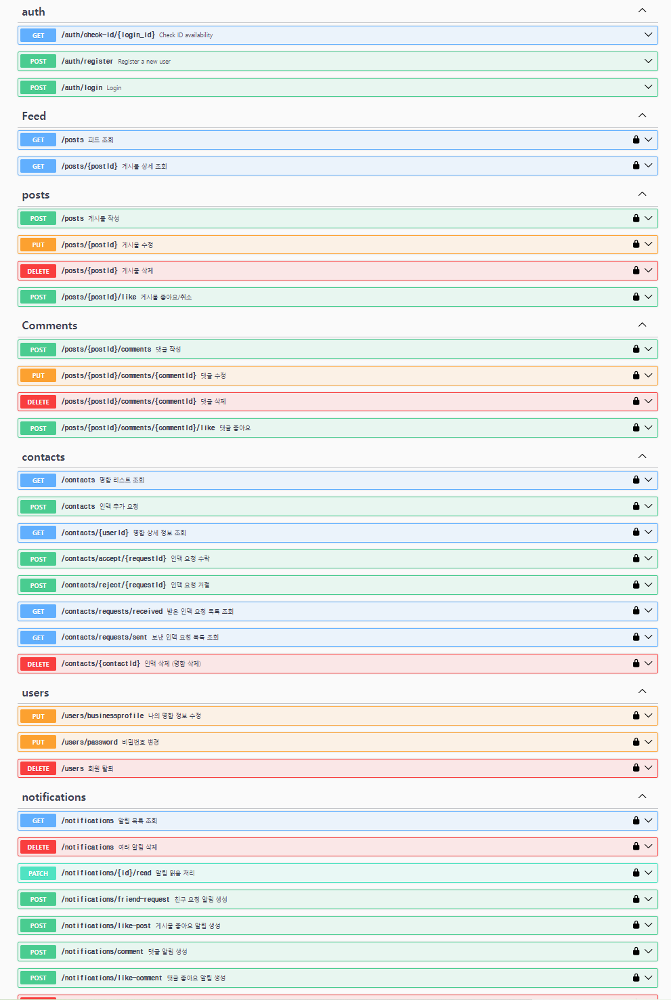

# 비즈니스 인맥을 위한 sns 프로젝트

### 🎯기획 의도
명함을 주고받은 이후에 비즈니스 목적이 없으면 연락을 하지 않게 됩니다.
비즈니스 외에도 연결고리를 만들 수 있다면 비즈니스 목적 없는 좋은 만남을 만들어나갈 수 있다고 생각하여
본 서비스를 기획하였습니다.

## 🔑주요 기능

1. **회원가입 및 비즈니스 정보 수집**  
   - 회원가입 시 회사명, 직책, 연락처 등의 비즈니스 정보를 입력하여 개인 명함을 생성합니다.

2. **인맥 관리**  
   - 아이디를 통해 인맥을 추가하고, 추가된 인맥의 비즈니스 정보를 확인할 수 있습니다.
   - 인맥 리스트에서 특정 유저를 클릭하면 해당 유저의 명함 정보와 피드를 함께 볼 수 있습니다.

3. **게시물 피드**  
   - 메인 피드 페이지에서는 본인의 게시물뿐만 아니라 나와 인맥들이 작성한 모든 게시물이 표시됩니다.
   - 게시물에 좋아요를 누르거나 댓글을 작성할 수 있습니다.

4. **알림 기능**  
   - 30초마다 새로운 알림을 조회하여 게시물에 대한 좋아요, 댓글, 친구 요청 등을 확인할 수 있습니다.

5. **유저 정보 수정**  
   - 유저는 자신의 비즈니스 프로필 및 계정 정보를 수정할 수 있으며, 비밀번호 변경 기능을 제공합니다.
## 프로젝트 아키텍처

```mermaid
graph TD
    subgraph "클라이언트"
        A[사용자 브라우저]
    end

    subgraph "프론트엔드 (React)"
        B[React 앱]
        C[Redux]
        D[React Router]
        E[Axios]
    end

    subgraph "백엔드 (NestJS)"
        G[NestJS 앱]
        H[Auth 모듈]
        I[Users 모듈]
        J[Posts 모듈]
        K[Comments 모듈]
        L[Likes 모듈]
        M[S3 모듈]
        N[TypeORM]
        O[JWT]
    end

    subgraph "데이터베이스"
        Q[(MySQL)]
    end

    subgraph "스토리지"
        R[AWS S3]
    end

    subgraph "인프라"
        S[프론트엔드: AWS S3]
        T[백엔드: AWS EC2]
        U[Docker 컨테이너]
    end

    subgraph "CI/CD (백엔드)"
        V[GitHub]
        W[GitHub Actions]
        X[Docker Hub]
    end

    A --> S
    S --> B
    B --> C
    B --> D
    B --> E
    E -->|API 요청| T
    T --> G
    G --> H & I & J & K & L & M
    H & I & J & K & L & M --> N
    H --> O
    N -->|쿼리| Q
    M -->|이미지 업로드/다운로드| R
    V -->|코드 푸시| W
    W -->|도커 이미지 빌드 & 푸시| X
    X -.->|이미지 풀| T
    T --> U
    U --> G

    classDef client fill:#F9F9F9,stroke:#333,stroke-width:2px;
    classDef frontend fill:#61DAFB,stroke:#61DAFB,stroke-width:2px,color:#000;
    classDef backend fill:#E0234E,stroke:#E0234E,stroke-width:2px,color:#fff;
    classDef database fill:#00758F,stroke:#00758F,stroke-width:2px,color:#fff;
    classDef storage fill:#FF9900,stroke:#FF9900,stroke-width:2px,color:#000;
    classDef infra fill:#4CAF50,stroke:#4CAF50,stroke-width:2px,color:#fff;
    classDef cicd fill:#24292E,stroke:#24292E,stroke-width:2px,color:#fff;

    class A client;
    class B,C,D,E frontend;
    class G,H,I,J,K,L,M,N,O backend;
    class Q database;
    class R storage;
    class S,T,U infra;
    class V,W,X cicd;
```


### 💻기술 스택
- **프론트엔드**:  
  
  
  
  

- **백엔드**:  
  
  
  
  
  
  

- **배포**:  


## 🛠️개발 과정
<details>
<summary>클릭하여 작업 과정을 확인하세요</summary>

### 기능 구현
- **프론트엔드**
    - **Redux**로 유저 정보 및 알림 상태 관리.
    - **MyPage와 특정 유저 페이지**에서 나의 명함 정보와 특정 유저의 피드 및 게시물 정보 조회.
    - **피드 페이지**에서 나 + 인맥들의 피드 좋아요, 댓글, 게시물 작성/수정 기능 구현.
    - **인맥 리스트**에서 특정 유저 클릭 시, 우측에 상세 정보만 보이는 UI 구성.
    - **로그인되지 않은 사용자**는 특정 페이지 접근 차단을 통해 보안 강화.
    - **유저 정보 변경 기능**을 통해 사용자 프로필과 명함 정보 수정 가능.
- **백엔드**:
    - **JWT 인증 및 인증 가드**:
        - JWT 토큰을 사용해 인증을 처리하고, 인증 가드를 적용해 사용자 요청을 보호합니다.
    - **TypeORM**:
        - TypeORM을 사용해 데이터베이스 스키마를 관리하고, 엔티티를 통해 데이터베이스 작업을 제어합니다.
    - **알림 기능**:
        - 게시물 좋아요, 댓글 작성, 친구 요청 시 알림을 생성하고 관리하는 기능을 구현했습니다.
    - **게시물 및 댓글 관리**:
        - 게시물 작성, 댓글 작성 및 수정/삭제 기능을 제공하며, 관련 작업에서 트랜잭션을 사용해 데이터 일관성을 보장합니다.
    - **인맥 관리**:
        - 사용자는 친구 요청을 보내고 수락하여 인맥을 형성할 수 있으며, 인맥 관련 정보를 관리하는 기능을 구현했습니다.
    - **유저 정보 수정**:
        - 유저는 자신의 비즈니스 프로필과 계정 정보를 수정할 수 있으며, 비밀번호 변경 기능도 포함됩니다.
    - **S3 파일 업로드 및 관리**:
        - AWS S3를 사용해 파일을 업로드하고 관리하는 기능을 구현했습니다.

### 배포 및 백엔드 자동화
- **프론트엔드 배포 (S3)**: 프론트엔드는 `npm run build` 명령어로 빌드 후 생성된 `dist` 폴더를 **S3** 버킷에 업로드하여 배포.
    - S3 버킷에서 정적 웹 사이트 호스팅 설정을 통해 프론트엔드 정적 파일 서빙.
- **백엔드 배포 (EC2 + Docker)**:
    - 백엔드는 **EC2**에 **Docker**를 사용해 배포.
    - EC2 인스턴스에 MySQL을 설치하여 데이터베이스 관리.
    - Nest.js 백엔드 애플리케이션은 Docker 컨테이너로 실행되며, MySQL과 연동하여 동작.
    - 모든 환경 변수(데이터베이스 정보, JWT 비밀 키, S3 정보, AWS 자격 증명 등)는 **GitHub Secrets**로 관리.
- **백엔드 자동화 (GitHub Actions)**:
    - `devlop` 또는 `master` 브랜치에 코드가 푸시되면, GitHub Actions가 트리거되어 백엔드 애플리케이션이 자동으로 배포되도록 설정.
    - **Docker Hub**에 이미지를 빌드 및 푸시한 후, **EC2 인스턴스**에서 최신 이미지를 pull하여 Docker 컨테이너를 자동으로 업데이트.

### 성능 최적화 및 리팩토링
1. **인덱스 추가**

- **인덱스 적용**: 자주 사용하는 컬럼에 인덱스를 추가하여 **검색 성능**을 향상시킴.
    - 예를 들어, `login_id`는 사용자가 자주 검색하는 필드이므로 인덱스를 추가해 데이터베이스 검색을 최적화.
    - 이러한 인덱스는 주로 **데이터 검색 속도**를 개선하며, 특히 자주 조회되는 필드에 효과적.

2. **트랜잭션 처리**

- **트랜잭션 사용**: 회원가입, 게시물 생성 등 여러 데이터베이스 연산을 하나의 작업 단위로 묶어 **데이터 일관성**을 보장.
    - 게시물 작성, 댓글 작성 등의 작업이 완료되지 않으면 모든 작업이 롤백되도록 하여 **데이터 무결성**을 유지.

3. **쿼리 빌더 사용**

- 복잡한 쿼리를 작성할 때 **쿼리 빌더**를 사용하여 더욱 효율적으로 데이터베이스와 통신.
    - 단순한 쿼리보다는 여러 조건이 필요한 경우 쿼리 빌더를 활용해 효율적인 데이터 조회 및 업데이트를 구현.

4. **캐싱 도입**

- **JWT 인증**을 최적화하기 위해 **캐시(Cache)**를 사용하여 반복적인 사용자 데이터 조회를 최소화.
    - 사용자의 인증 정보는 한 번 캐싱된 후, 이후 요청에서 데이터베이스 조회 없이 빠르게 반환되도록 처리.
    - 이로 인해 **서버 부하 감소**와 **응답 속도** 개선 효과를 얻음.

5. **N+1 문제 해결 및 쿼리 최적화**

- **N+1 문제 해결**: 게시물이나 알림 조회 시 한 번의 쿼리로 모든 데이터를 가져오도록 **쿼리 최적화**.
    - 다수의 데이터를 조회할 때 발생할 수 있는 N+1 문제 해결
    - **불필요한 추가 쿼리**를 줄이고 필요한 데이터만 가져오도록 개선.

6. **중앙 에러 처리 및 로깅**

- **에러 핸들링**을 중앙에서 처리하고 **로깅 시스템**을 추가하여 에러 발생 시 개발자가 문제를 빠르게 파악할 수 있도록 함.
    - 에러 발생 시 **요청 정보**와 **에러 스택**을 기록하여, 추후 디버깅 시 더 쉽게 문제를 찾을 수 있게 함.
    - 로깅을 통해 **실시간 디버깅**과 **프로덕션 환경 문제 해결**을 보다 신속하게 처리.

7. **S3 파일 업로드 최적화**

- **S3 클라이언트 초기화** 및 **연결 풀링**을 통해 S3 파일 업로드 성능을 개선.
    - S3 클라이언트는 한 번만 초기화하고 재사용하도록 하여 **클라이언트 생성 비용**을 줄임.
    - **스트림 기반 파일 업로드**를 도입하여 대용량 파일 처리 시 메모리 사용량을 줄임.
    - 이러한 최적화는 추후 **대규모 트래픽**에서도 안정적으로 파일 업로드를 처리할 수 있게 함.

</details>

## 역할 분담

### 강용제
- 프로젝트 기획 및 와이어프레임 설계
- 프론트엔드 초기 개발 (React)
  - MVP 기반의 기본 기능 및 페이지 구현
  - UI/UX 디자인 및 기본 컴포넌트 개발
  - API 호출 로직 및 인증 기능 구현

### 김도연
- 백엔드 개발 (NestJS)
  - 전체 백엔드 아키텍처 설계 및 RESTful API 구현
  - 데이터베이스 설계 및 ORM 활용 (MySQL, TypeORM)
  - 인증/보안 로직, 파일 업로드, 성능 최적화

- 프론트엔드 개발 및 개선 (React)
  - 알림 기능 및 Redux 상태 관리 구현
  - 보안 로직 강화 및 추가 기능 구현 (인맥 등)
  - UX/UI 개선 및 버그 수정

- 배포 및 인프라 관리
  - AWS 서비스 구성 (EC2, S3) 및 Docker 활용
  - GitHub Actions를 통한 백엔드 CI/CD 구축

### 📅개발 기간
- **2024년 9월 15일 ~ 10월 8일 (24일)**

### ℹ️ 사용 버전
- **React**: `v18.3.1`
- **React-Router-DOM**: `v6.26.2`
- **Redux Toolkit**: `v2.2.7`
- **TypeScript**: `v5.5.3`
- **Vite**: `v5.4.1`
- **Node.js**: `v20.15.0`
- **NestJS**: `v10.0.0`
- **MySQL**: `v8.0.39`
- **TypeORM**: `v0.3.20`

### 🗂️프로젝트 구조
<details>
<summary>프론트엔드</summary>
  
```bash
Devlntro_front/
│
│
├── src/
│   ├── api/
│   │   ├── axiosInstance.ts
│   │   └── useAuthRedirect.ts
│   │
│   ├── assets/
│   │   └── react.svg
│   │
│   ├── components/
│   │   ├── FeedDetail.tsx
│   │   ├── NavBar.tsx
│   │   ├── PasswordChange.tsx
│   │   └── ProtectedRoute.tsx
│   │
│   ├── contexts/
│   │   └── AuthContext.tsx
│   │
│   ├── pages/
│   │   ├── CreatePostPage.tsx
│   │   ├── FeedPage.tsx
│   │   ├── FriendsFeedPage.tsx
│   │   ├── FriendsPage.tsx
│   │   ├── LoginPage.tsx
│   │   ├── MyPage.tsx
│   │   └── SignUpPage.tsx
│   │
│   ├── redux/
│   │   ├── store.ts
│   │   ├── userSlice.ts
│   │   └── notificationSlice.ts
│   │
│   ├── App.css
│   ├── App.tsx
│   ├── index.css
│   └── main.tsx
│
├── .env.development
├── .env.production
├── .eslintrc.cjs
├── .gitignore
├── index.html
├── package-lock.json
├── package.json
├── README.md
├── tsconfig.json
├── tsconfig.node.json
└── vite.config.ts

```

- `src/`: 소스 코드를 포함하는 메인 디렉토리
  - `api/`: API 관련 설정 및 인스턴스
  - `assets/`: 이미지 등의 정적 자원
  - `components/`: 재사용 가능한 React 컴포넌트
  - `contexts/`: React Context API를 사용한 상태 관리
  - `pages/`: 각 페이지를 나타내는 컴포넌트
  - `redux/`: Redux 관련 파일 (스토어 설정, 슬라이스 등)
- `.env.development` 및 `.env.production`: 개발 및 프로덕션 환경 변수 설정
- `vite.config.ts`: Vite 설정 파일
- `package.json`: 프로젝트 의존성 및 스크립트 정의
</details>

<details>
<summary>백엔드</summary>
  
```bash
Devlntro_api/
│
├── src/
│   ├── auth/
│   │   ├── auth.controller.ts
│   │   ├── auth.module.ts
│   │   ├── auth.service.ts
│   │   ├── auth.controller.spec.ts
│   │   ├── auth.service.spec.ts
│   │   ├── jwt-auth.guard.ts
│   │   ├── jwt.strategy.ts
│   │   └── dto/
│   │       ├── comment.dto.ts
│   │
│   ├── comment/
│   │   ├── comment.controller.ts
│   │   ├── comment.module.ts
│   │   ├── comment.service.ts
│   │   └── dto/
│   │       ├── comment.dto.ts
│   │
│   ├── common/
│   ├── contacts/
│   │   ├── contacts.controller.ts
│   │   ├── contacts.module.ts
│   │   ├── contacts.service.ts
│   │   └── dto/
│   │       ├── create-contact.dto.ts
│   │
│   ├── controllers/
│   │   └── sample.controller.ts
│   ├── dto/
│   │   ├── feed-query.dto.ts
│   │   ├── sample.dto.ts
│   ├── entities/
│   │   ├── business-contact.entity.ts
│   │   ├── business-profile.entity.ts
│   │   ├── comment-like.entity.ts
│   │   ├── comment.entity.ts
│   │   ├── friend-request.entity.ts
│   │   ├── notification.entity.ts
│   │   ├── post-like.entity.ts
│   │   ├── post.entity.ts
│   │   └── user-account.entity.ts
│   ├── feed/
│   │   ├── feed.controller.ts
│   │   ├── feed.module.ts
│   │   ├── feed.service.ts
│   ├── migrations/
│   │   ├── 1726495772853-InitialMigration.ts
│   │   ├── 1726674158617-RenameLikes.ts
│   │   ├── 1726743763543-AddDeletedAtToPost.ts
│   │   ├── 1726757374843-AddDeletedAtToUser.ts
│   │   ├── 1726844599137-AddConfirmPassword.ts
│   │   ├── 1727088144419-CreateFriendRequest.ts
│   │   ├── 1727102625007-AddDeleteAtToNotification.ts
│   │   ├── 1727185582581-UpdateRemainingTokens.ts
│   │   ├── 1727956898358-CreateNotificationEntity.ts
│   │   ├── 1727963072309-AddPostIdAndUserIdToPost.ts
│   │   └── 1728369960382-AddDeletedAtToPostLike.ts
│   ├── notification/
│   │   ├── notifications.controller.ts
│   │   ├── notifications.module.ts
│   │   ├── notifications.service.ts
│   ├── post/
│   │   ├── post.controller.ts
│   │   ├── post.module.ts
│   │   ├── post.service.ts
│   │   └── dto/
│   │       ├── post.dto.ts
│   ├── s3/
│   │   └── s3.module.ts
│   ├── seeds/
│   │   └── initial-data.seed.ts
│   ├── services/
│   │   ├── feed-filter.service.ts
│   │   ├── sorting-service.ts
│   ├── user/
│   │   ├── dto/
│   │   ├── user.controller.ts
│   │   ├── user.module.ts
│   │   ├── user.service.ts
│   ├── app.controller.spec.ts
│   ├── app.controller.ts
│   ├── app.module.ts
│   ├── app.service.ts
│   ├── main.ts
│   └── ormconfig.ts
├── test/
├── .dockerignore
├── .env
├── .eslintrc.js
├── .gitignore
├── .prettierrc
├── Dockerfile
├── nest-cli.json
├── package-lock.json
├── package.json
└── README.md
```
- `src`: 메인 소스 코드 디렉토리
- `auth`: 인증 관련 모듈, 컨트롤러, 서비스
- `users`: 사용자 관리 관련 모듈, 컨트롤러, 서비스, DTO
- `posts`: 게시물 관리 관련 모듈, 컨트롤러, 서비스, DTO
- `comments`: 댓글 관리 관련 모듈, 컨트롤러, 서비스, DTO
- `contacts`: 인맥 관리 관련 모듈, 컨트롤러, 서비스, DTO
- `feed`: 사용자 피드 관련 기능, 모듈, 서비스
- `notifications`: 알림 관련 모듈, 컨트롤러, 서비스
- `s3`: S3 관련 파일 업로드 모듈
- `migrations`: 데이터베이스 마이그레이션 파일들
- `seeds`: 데이터베이스 초기 데이터를 위한 시드 파일
- `services`: 여러 기능에 대한 서비스 레이어 코드
  - `feed-filter.service.ts`: 피드 필터링 로직을 처리하는 서비스
  - `sorting-service.ts`: 정렬 로직을 처리하는 서비스
- `database`: 데이터베이스 연결 설정 모듈
- `common`: 공통으로 사용되는 필터, 파이프라인 등
- `config`: 환경 설정 관련 파일
- `controllers`: 기타 컨트롤러 코드 모음
- `dto`: 공통 데이터 전송 객체 (DTO) 모음
- `entities`: 데이터베이스 엔티티 정의
  - `post.entity.ts`: 게시물 관련 엔티티 정의
  - `comment.entity.ts`: 댓글 관련 엔티티 정의
  - `user-account.entity.ts`: 사용자 계정 관련 엔티티 정의
  - `notification.entity.ts`: 알림 관련 엔티티 정의
- `main.ts`: 백엔드 애플리케이션의 진입점
- `.env`: 환경 변수 파일
- `.dockerignore`: Docker 관련 불필요 파일 제외
- `Dockerfile`: Docker 설정 파일
- `.eslintrc.js`: ESLint 설정 파일
- `.prettierrc`: Prettier 설정 파일
- `ormconfig.ts`: TypeORM 설정 파일
- `package.json`: 프로젝트 의존성 및 스크립트 정의
- `tsconfig.json`: TypeScript 설정 파일
- `README.md`: 프로젝트 설명 문서


</details>

### 📚Swagger UI


### 🗄️ERD 설계도


### 📋API 명세서
<details>
<summary>API 명세서 펼치기/접기</summary>

## 1. 인증 및 사용자 관리
<details>
<summary>1.1 아이디 중복 검사</summary>

- **엔드포인트**: GET /auth/check-id/{login_id}
- **응답**:
    - 사용 **가능** (200 OK):
        
        ```json
        {
          "statusCode": 200,
          "message": "사용 가능한 아이디입니다."
        }
        ```
        
    - 사용 **불가** (200 OK):
        
        ```json
        {
          "statusCode": 200,
          "message": "이미 사용 중인 아이디입니다."
        }
        ```
</details>        

<details>
<summary>1.2 회원가입</summary>

- **엔드포인트**: POST /auth/register
- **요청 본문**:
    
    ```json
    {
      "login_id": "String",
      "password": "String",
      "confirmPassword": "String",
      "name": "String",
      "company": "String",
      "department": "String",
      "position": "String",
      "email": "String",
      "phone": "String"
    }
    ```
    
- **응답**:
    - **성공** (201 OK):
        
        ```json
        {
          "statusCode": 201,
          "message": "회원가입이 성공적으로 완료되었습니다.",
          "userId": "Number"
        }
        ```
        
    
    - **아이디 중복** (400 Bad Request):
        
        ```json
        {
          "statusCode": 400,
          "message": "이미 존재하는 아이디입니다.",
          "error": "Bad Request"
        }
        ```
        
    - **비밀번호 불일치** (400 Bad Request)
    - **서버 내부 에러**
        
        ```json
        {
          "statusCode": 400,
          "message": "비밀번호와 확인 비밀번호가 일치하지 않습니다.",
          "error": "Bad Request"
        }
        ```
</details>        

<details>
<summary>1.3 로그인</summary>

- **엔드포인트**: POST /auth/login
- **요청 본문**:
    
    ```json
    {
      "login_id": "String",
      "password": "String"
    }
    
    ```
    
- **응답**:
    - 성공 (200 OK):
        
        ```json
        {
          "statusCode": 200,
          "message": "로그인 성공",
          "token": "JWT_TOKEN",
          "userId": "Number"
        }
        
        ```
        
    - 실패 (401 Unauthorized):
        
        ```json
        {
          "statusCode": 401,
          "message": "아이디 또는 비밀번호가 잘못되었습니다.",
          "error": "Unauthorized"
        }
        ```
</details>        

## 2. 게시물 조회 (통합 엔드포인트)

<details>
<summary>2.1 피드 조회 (메인 페이지, 내 게시물, 특정 유저 게시물 조회)</summary>

- **엔드포인트**: `GET /posts`
- **헤더**: `Authorization: Bearer {JWT_TOKEN}`
- **쿼리 파라미터**:
    - `sort`: `"latest"`, `"likes"`, `"comments"` (정렬 기준 선택, 기본값은 `"latest"`)
    - `filter`: `"all"`, `"own"`, `"specific"` (게시물 필터링)
    - `specificUserId`: 특정 유저 게시물 조회 시 필요한 유저 ID

### **요청 예시**:

- **메인 페이지 (본인 + 인맥 게시물)**:
    
    ```sql
    GET /posts?filter=all&sort=latest
    ```
    
- **내 게시물 조회 (마이 게시물)**:
    
    ```bash
    GET /posts?filter=own&sort=latest
    ```
    
- **특정 유저 페이지 (특정 유저 게시물)**:
    
    ```sql
    GET /posts?filter=specific&specificUserId=123&sort=comments
    ```
    

### **응답 예시**:

### 성공 (200 OK):

```json
{
  "statusCode": 200,
  "message": "피드를 성공적으로 조회했습니다.",
  "posts": [
    {
      "postId": 123,
      "createrId": 456,
      "createrName": "홍길동",
      "createdAt": "2024-09-18T12:34:56.000Z",
      "imageUrl": "https://example.com/image.jpg",
      "isOwnPost": true},
    {
      "postId": 124,
      "createrId": 789,
      "createrName": "김철수",
      "createdAt": "2024-09-18T13:00:00.000Z",
      "imageUrl": "https://example.com/image2.jpg",
      "isOwnPost": false}
  ]
}
```

### 잘못된 파라미터 (400 Bad Request):

```json
{
  "statusCode": 400,
  "message": "잘못된 요청입니다. specificUserId가 필요합니다.",
  "error": "Bad Request"
}
```

### 게시물 없음 (404 Not Found):

```json
{
  "statusCode": 404,
  "message": "해당 게시물을 찾을 수 없습니다.",
  "error": "Not Found"
}
```

---
</details>

<details>
<summary>2.2 게시물 상세 조회</summary>

- **엔드포인트**: `GET /posts/{postId}`
- **헤더**: `Authorization: Bearer {JWT_TOKEN}`

### **응답 예시**:

### 성공 (200 OK):

```json
{
  "statusCode": 200,
  "message": "게시물을 성공적으로 조회했습니다.",
  "postId": 123,
  "createrId": 456,
  "createrName": "홍길동",
  "createdAt": "2024-09-18T12:34:56.000Z",
  "imageUrl": "https://example.com/image.jpg",
  "content": "이 게시물의 내용입니다.",
  "likesCount": 42,
  "commentsCount": 10,
  "isOwnPost": true,
  "comments": [
    {
      "commentId": 1,
      "authorName": "김철수",
      "content": "멋진 게시물이네요!",
      "createdAt": "2024-09-18T12:45:00.000Z"
    },
    {
      "commentId": 2,
      "authorName": "이영희",
      "content": "좋은 글 감사합니다.",
      "createdAt": "2024-09-18T13:00:00.000Z"
      "likeCount": "2"
    }
  ],
  "likes": [
    {
      "userId": 789,
      "userName": "김철수"
    },
    {
      "userId": 890,
      "userName": "이영희"
    }
  ]
}
```

### 유효하지 않은 게시물 ID (400 Bad Request):

```json
{
  "statusCode": 400,
  "message": "유효하지 않은 게시물 ID입니다.",
  "error": "Bad Request"
}
```

### 게시물 없음 (404 Not Found):

```json
{
  "statusCode": 404,
  "message": "해당 게시물을 찾을 수 없습니다.",
  "error": "Not Found"
}
```
</details>

## 3. 게시물 관리

<details>
<summary>3.1 게시물 작성</summary>

- **엔드포인트**: POST /posts
- **헤더**: Authorization: Bearer {JWT_TOKEN}
- **요청 본문**:
    - **Form Data**:
        - `content`: String (필수) - 게시물 내용
        - `image`: File (선택) - 업로드할 이미지 파일
- **응답**:
    - **성공** (201 Created):
        
        ```json
        {
          "statusCode": 201,
          "message": "게시물이 성공적으로 작성되었습니다.",
          "postId": "Number"
        }
        ```
        
    - **실패** (400 Bad Request):
        
        ```json
        {
          "statusCode": 400,
          "message": "게시물 작성에 실패했습니다. 필수 필드를 확인해주세요.",
          "error": "Bad Request"
        }
        ```
</details>        

<details>
<summary>3.2 게시물 수정</summary>

- **엔드포인트**: PUT /posts/{postId}
- **헤더**: Authorization: Bearer {JWT_TOKEN}
- **요청 본문**:
    - **Form Data**:
        - `content`: String (선택) - 게시물 내용
        - `image`: File (선택) - 새로 업로드할 이미지 파일
- **응답**:
    - **성공** (200 OK):
        
        ```json
        {
          "statusCode": 200,
          "message": "게시물이 성공적으로 수정되었습니다."
        }
        ```
        
    - **실패** (400 Bad Request):
        
        ```json
        {
          "statusCode": 400,
          "message": "게시물 수정에 실패했습니다. 유효한 데이터를 입력해주세요.",
          "error": "Bad Request"
        }
        ```
        
    - **실패** (404 Not Found):
        
        ```json
        {
          "statusCode": 404,
          "message": "게시물을 찾을 수 없습니다.",
          "error": "Not Found"
        }
        
        ```
</details>        

<details>
<summary>3.3 게시물 삭제</summary>

- **엔드포인트**: DELETE /posts/{postId}
- **헤더**: Authorization: Bearer {JWT_TOKEN}
- **응답**:
    - **성공** (200 OK):
        
        ```json
        {
          "statusCode": 200,
          "message": "게시물이 성공적으로 삭제되었습니다."
        }
        ```
        
    - **실패** (404 Not Found):
        
        ```json
        {
          "statusCode": 404,
          "message": "게시물을 찾을 수 없습니다.",
          "error": "Not Found"
        }
        ```
</details>        

<details>
<summary>3.4 게시물 좋아요</summary>

- **엔드포인트**: POST /posts/{postId}/like
- **헤더**: Authorization: Bearer {JWT_TOKEN}
- **응답**:
    - **성공** (200 OK):
        
        ```json
        {
          "statusCode": 200,
          "message": "게시물에 좋아요를 눌렀습니다.",
          "likeCount": "Number"
        }
        ```
        
    - **성공** (200 OK) - 좋아요 취소:
        
        ```json
        {
          "statusCode": 200,
          "message": "게시물 좋아요를 취소했습니다.",
          "likeCount": "Number"
        }
        ```
        
    - **실패** (404 Not Found):
        
        ```json
        {
          "statusCode": 404,
          "message": "게시물을 찾을 수 없습니다.",
          "error": "Not Found"
        }
        ```
 </details>       

## 4. 댓글관리

<details>
<summary>댓글 작성</summary>

- **엔드포인트**: POST /posts/{postId}/comments
- **헤더**: Authorization: Bearer {JWT_TOKEN}
- **요청 본문**:
    
    ```json
    {
      "content": "String"
    }
    ```
    
- **응답**:
    - **성공** (201 Created):
        
        ```json
        {
          "statusCode": 201,
          "message": "댓글이 성공적으로 작성되었습니다.",
          "commentId": "Number"
        }
        ```
        
    - **실패** (400 Bad Request):
        
        ```json
        {
          "statusCode": 400,
          "message": "댓글 작성에 실패했습니다. 내용을 입력해주세요.",
          "error": "Bad Request"
        }
        ```
</details>        

<details>
<summary>댓글 수정</summary>

- **엔드포인트**: PUT /posts/{postId}/comments/{commentId}
- **헤더**: Authorization: Bearer {JWT_TOKEN}
- **요청 본문**:
    
    ```json
    {
      "content": "String"
    }
    ```
    

**응답**

- **성공** (200 OK):
    
    ```json
    {
      "statusCode": 200,
      "message": "댓글이 성공적으로 수정되었습니다."
    }
    ```
    
- **실패** (400 Bad Request):
    
    ```json
    {
      "statusCode": 400,
      "message": "댓글 수정에 실패했습니다. 유효한 내용을 입력해주세요.",
      "error": "Bad Request"
    }
    ```
    
- **실패** (404 Not Found):
    
    ```json
    {
      "statusCode": 404,
      "message": "댓글을 찾을 수 없습니다.",
      "error": "Not Found"
    }
    ```
</details>     

<details>
<summary>댓글 삭제</summary>

- **엔드포인트**: DELETE /posts/{postId}/comments/{commentId}
- **헤더**: Authorization: Bearer {JWT_TOKEN}
- **응답**:
    - **성공** (200 OK):
        
        ```json
        {
          "statusCode": 200,
          "message": "댓글이 성공적으로 삭제되었습니다."
        }
        ```
        
    - **실패** (404 Not Found):
        
        ```json
        {
          "statusCode": 404,
          "message": "댓글을 찾을 수 없습니다.",
          "error": "Not Found"
        }
        ```
</details>

<details>
<summary>댓글 좋아요</summary>

- **엔드포인트**: POST /posts/{postId}/comments/{commentId}/like
- **헤더**: Authorization: Bearer {JWT_TOKEN}
- **응답**:
    - **성공** (200 OK) - 좋아요 추가:
        
        ```json
        {
          "statusCode": 200,
          "message": "댓글에 좋아요를 눌렀습니다.",
          "likeCount": "Number"
        }
        ```
        
    - **성공** (200 OK) - 좋아요 취소:
        
        ```json
        {
          "statusCode": 200,
          "message": "댓글 좋아요를 취소했습니다.",
          "likeCount": "Number"
        }
        ```
        
    - **실패** (404 Not Found):
        
        ```json
        {
          "statusCode": 404,
          "message": "댓글을 찾을 수 없습니다.",
          "error": "Not Found"
        }

        ```
</details>        

## 5. 명함 관리

<details>
<summary>5.1 명함 리스트 조회</summary>

- **엔드포인트**: GET /contacts
- **헤더**: `Authorization: Bearer {JWT_TOKEN}`
- **응답**:
    - 성공 (200 OK):
        
        ```json
        {
          "statusCode": 200,
          "message": "명함 리스트를 성공적으로 조회했습니다.",
          "contacts": [
            {
              "userId": "Number",
              "name": "String",
              "company": "String",
              "department": "String"
            }
          ]
        }
        ```
        
    - 실패 (400 Bad Request):
        
        ```json
        {
          "statusCode": 400,
          "message": "잘못된 요청입니다.",
          "error": "Bad Request"
        }
        ```
        
    - 실패 (404 Not Found):
        
        ```json
        {
          "statusCode": 404,
          "message": "명함 리스트를 찾을 수 없습니다.",
          "error": "Not Found"
        }
        ```
</details>        

<details>
<summary>5.2 명함 상세 정보 조회</summary>

- **엔드포인트**: GET /contacts/{userId}
- **헤더**: `Authorization: Bearer {JWT_TOKEN}`
- **응답**:
    - 성공 (200 OK):
        
        ```json
        {
          "statusCode": 200,
          "message": "명함 상세 정보를 성공적으로 조회했습니다.",
          "contact": {
            "userId": "Number",
            "name": "String",
            "company": "String",
            "department": "String",
            "position": "String",
            "email": "String",
            "phone": "String"
          }
        }
        ```
        
    - 실패 (400 Bad Request):
        
        ```json
        {
          "statusCode": 400,
          "message": "유효하지 않은 사용자 ID입니다.",
          "error": "Bad Request"
        }
        ```
        
    - 실패 (404 Not Found):
        
        ```json
        {
          "statusCode": 404,
          "message": "해당 사용자의 명함을 찾을 수 없습니다.",
          "error": "Not Found"
        }
        ```
</details>        

<details>
<summary>5.3 인맥 추가 (명함 추가)</summary>

- **엔드포인트**: POST /contacts
- **헤더**: `Authorization: Bearer {JWT_TOKEN}`
- **요청 본문**:
    
    ```json
    {
      "loginId": "Number"
    }
    ```
    
- **응답**:
    - 성공 (201 Created):
        
        ```json
        {
          "statusCode": 201,
          "message": "인맥이 요청이 성공적으로 추가되었습니다.",
          "contactId": "Number"
        }
        ```
        
    - 실패 (400 Bad Request):
        
        ```json
        {
          "statusCode": 400,
          "message": "대상 사용자를 찾을 수 없습니다.",
          "error": "Bad Request"
        }
        ```
        
    - 실패 (409 Conflict):
        
        ```json
        {
          "statusCode": 409,
          "message": "이미 인맥 요청을 보냈거나 인맥 관계가 존재합니다.",
          "error": "Conflict"
        }
        ```
 </details>        

<details>
<summary>5.4 인맥 요청 수락</summary>

- **엔드포인트**: POST /contacts/accept/{requestId}
- **헤더**: `Authorization: Bearer {JWT_TOKEN}`
- **응답**:
    - 성공 (200 OK):

```json
{
  "statusCode": 200,
  "message": "인맥 요청이 수락되었습니다.",
  "contactId": "Number"// 새로 생성된 인맥 관계의 ID
}
```

- 실패 (400 Bad Request):

```json
{
  "statusCode": 400,
  "message": "유효하지 않은 요청입니다.",
  "error": "Bad Request"
}
```

- 실패 (404 Not Found):

```json
{
  "statusCode": 404,
  "message": "해당 인맥 요청을 찾을 수 없습니다.",
  "error": "Not Found"
}
```
</details>

<details>
<summary>5.5 인맥 요청 거절</summary>

- **엔드포인트**: POST /contacts/reject/{requestId}
- **헤더**: `Authorization: Bearer {JWT_TOKEN}`
- **응답**:
    - 성공 (200 OK):

```json
{
  "statusCode": 200,
  "message": "인맥 요청이 거절되었습니다."
}
```

- 실패 (400 Bad Request):

```json
{
  "statusCode": 400,
  "message": "유효하지 않은 요청입니다.",
  "error": "Bad Request"
}
```

- 실패 (404 Not Found):

```json
{
  "statusCode": 404,
  "message": "해당 인맥 요청을 찾을 수 없습니다.",
  "error": "Not Found"
}
```
</details>

<details>
<summary>5.6 받은 인맥 요청 목록 조회</summary>

- **엔드포인트**: GET /contacts/requests/received
- **헤더**: `Authorization: Bearer {JWT_TOKEN}`
- **응답**:
    - 성공 (200 OK):

```json
{
  "statusCode": 200,
  "message": "받은 인맥 요청 목록을 성공적으로 조회했습니다.",
  "requests": [
    {
      "requestId": "Number",
      "senderLoginId": "String",
      "senderName": "String",
      "requestedAt": "DateTime"
    }
  ]
}
```

- 실패 (400 Bad Request):

```json
{
  "statusCode": 400,
  "message": "요청 처리 중 오류가 발생했습니다.",
  "error": "Bad Request"
}
```
</details>

<details>
<summary>5.7 보낸 인맥 요청 목록 조회</summary>

- **엔드포인트**: GET /contacts/requests/sent
- **헤더**: `Authorization: Bearer {JWT_TOKEN}`
- **응답**:
    - 성공 (200 OK):

```json
{
  "statusCode": 200,
  "message": "보낸 인맥 요청 목록을 성공적으로 조회했습니다.",
  "requests": [
    {
      "requestId": "Number",
      "senderLoginId": "String",
      "senderName": "String",
      "requestedAt": "DateTime"
    }
  ]
}
```

- 실패 (400 Bad Request):

```json
{
  "statusCode": 400,
  "message": "요청 처리 중 오류가 발생했습니다.",
  "error": "Bad Request"
}
```
</details>

<details>
<summary>5.8 인맥 삭제 (명함 삭제)</summary>

- **엔드포인트**: DELETE /contacts/{contactId}
- **헤더**: `Authorization: Bearer {JWT_TOKEN}`
- **응답**:
    - 성공 (200 OK):
        
        ```json
        {
          "statusCode": 200,
          "message": "인맥이 성공적으로 삭제되었습니다."
        }
        ```
        
    - 실패 (400 Bad Request):
        
        ```json
        {
          "statusCode": 400,
          "message": "유효하지 않은 인맥 ID입니다.",
          "error": "Bad Request"
        }
        ```
        
    - 실패 (404 Not Found):
        
        ```json
        {
          "statusCode": 404,
          "message": "해당 인맥을 찾을 수 없습니다.",
          "error": "Not Found"
        }
        ```
</details>        

## 6. 사용자 정보 관리

<details>
<summary>6.1 나의 명함 정보 수정</summary>
  
- **엔드포인트**: PUT /users/businessprofile
- **헤더**: `Authorization: Bearer {JWT_TOKEN}`
- **요청 본문**:
    
    ```json
    {
      "name": "String",
      "company": "String",
      "department": "String",
      "position": "String",
      "email": "String",
      "phone": "String"
    }
    ```
    
- **응답**:
    - 성공 (200 OK):
        
        ```json
        {
          "statusCode": 200,
          "message": "프로필 정보가 성공적으로 수정되었습니다."
        }
        ```
        
    - 실패 (400 Bad Request):
        
        ```json
        {
          "statusCode": 400,
          "message": "잘못된 요청입니다. 유효한 정보를 입력해주세요.",
          "error": "Bad Request"
        }
        ```
</details>         

<details>
<summary>6.2 비밀번호 변경 </summary>

- **엔드포인트**: PUT /users/password
- **헤더**: `Authorization: Bearer {JWT_TOKEN}`
- **요청 본문**:
    
    ```json
    {
      "currentPassword": "String",
      "newPassword": "String",
      "confirmNewPassword": "String"
    }
    ```
    
- **응답**:
    - 성공 (200 OK):
        
        ```json
        {
          "statusCode": 200,
          "message": "비밀번호가 성공적으로 변경되었습니다."
        }
        ```
        
    - 실패 (400 Bad Request):
        
        ```json
        {
          "statusCode": 400,
          "message": "새 비밀번호와 확인 비밀번호가 일치하지 않습니다.",
          "error": "Bad Request"
        }
        ```
        
    - 실패 (401 Unauthorized):
        
        ```json
        {
          "statusCode": 401,
          "message": "현재 비밀번호가 올바르지 않습니다.",
          "error": "Unauthorized"
        }
        ```
</details>        

<details>
<summary>6.3 회원 탈퇴</summary>

- **엔드포인트**: DELETE /users
- **헤더**: `Authorization: Bearer {JWT_TOKEN}`
- **요청 본문**:

```json
{
  "password": "String"
}
```

- **응답**:
    - 성공 (200 OK):

```json
{
  "statusCode": 200,
  "message": "회원 탈퇴가 성공적으로 처리되었습니다."
}
```

- 실패 (400 Bad Request):

```json
{
  "statusCode": 400,
  "message": "회원 탈퇴 처리 중 오류가 발생했습니다.",
  "error": "Bad Request"
}
```

- 실패 (401 Unauthorized):

```json
{
  "statusCode": 401,
  "message": "비밀번호가 올바르지 않습니다.",
  "error": "Unauthorized"
}
```
</details>

## 7. 알림 관리

<details>
<summary>7.1 알림 목록 조회</summary>

### 엔드포인트: `GET /notifications`
- **헤더**: `Authorization: Bearer {JWT_TOKEN}`
- **응답**:
    - **성공** (200 OK):
    
    ```json
    {
      "statusCode": 200,
      "message": "알림 목록을 성공적으로 조회했습니다.",
      "notifications": [
        {
          "notificationId": 1,
          "type": "friend_request",
          "message": "홍길동님이 친구 요청을 보냈습니다.",
          "postId": null,
          "commentId": null,
          "isRead": false,
          "createdAt": "2024-10-03T12:34:56Z",
          "senderId": 99
        }
      ]
    }
    ```
    
    - **실패** (400 Bad Request):
    
    ```json
    {
      "statusCode": 400,
      "message": "알림 조회 중 오류가 발생했습니다.",
      "error": "Bad Request"
    }
    ```

</details>

<details>
<summary>7.2 알림 읽음 처리</summary>

### 엔드포인트: `PATCH /notifications/{notificationId}/read`
- **헤더**: `Authorization: Bearer {JWT_TOKEN}`
- **응답**:
    - **성공** (200 OK):
    
    ```json
    {
      "statusCode": 200,
      "message": "알림이 성공적으로 읽음 처리되었습니다."
    }
    ```
    
    - **실패** (404 Not Found):
    
    ```json
    {
      "statusCode": 404,
      "message": "해당 알림을 찾을 수 없습니다.",
      "error": "Not Found"
    }
    ```

</details>

<details>
<summary>7.3 친구 요청 알림 생성</summary>

### 엔드포인트: `POST /notifications/friend-request`
- **헤더**: `Authorization: Bearer {JWT_TOKEN}`
- **요청 본문**:
    
    ```json
    {
      "receiverId": 99,
      "message": "홍길동님이 친구 요청을 보냈습니다."
    }
    ```
    
- **응답**:
    - **성공** (201 Created):
    
    ```json
    {
      "statusCode": 201,
      "message": "친구 요청 알림이 성공적으로 생성되었습니다.",
      "notificationId": 1
    }
    ```
    
    - **실패** (400 Bad Request):
    
    ```json
    {
      "statusCode": 400,
      "message": "친구 요청 알림 생성 중 오류가 발생했습니다.",
      "error": "Bad Request"
    }
    ```

</details>

<details>
<summary>7.4 게시물 좋아요 알림 생성</summary>

### 엔드포인트: `POST /notifications/like-post`
- **헤더**: `Authorization: Bearer {JWT_TOKEN}`
- **요청 본문**:
    
    ```json
    {
      "postId": 123,
      "receiverId": 456,
      "message": "김철수님이 당신의 게시물에 좋아요를 눌렀습니다."
    }
    ```
    
- **응답**:
    - **성공** (201 Created):
    
    ```json
    {
      "statusCode": 201,
      "message": "게시물 좋아요 알림이 성공적으로 생성되었습니다.",
      "notificationId": 2
    }
    ```
    
    - **실패** (400 Bad Request):
    
    ```json
    {
      "statusCode": 400,
      "message": "게시물 좋아요 알림 생성 중 오류가 발생했습니다.",
      "error": "Bad Request"
    }
    ```

</details>

<details>
<summary>7.5 댓글 알림 생성</summary>

### 엔드포인트: `POST /notifications/comment`
- **헤더**: `Authorization: Bearer {JWT_TOKEN}`
- **요청 본문**:
    
    ```json
    {
      "postId": 123,
      "receiverId": 456,
      "message": "이영희님이 당신의 게시물에 댓글을 남겼습니다."
    }
    ```
    
- **응답**:
    - **성공** (201 Created):
    
    ```json
    {
      "statusCode": 201,
      "message": "댓글 알림이 성공적으로 생성되었습니다.",
      "notificationId": 3
    }
    ```
    
    - **실패** (400 Bad Request):
    
    ```json
    {
      "statusCode": 400,
      "message": "댓글 알림 생성 중 오류가 발생했습니다.",
      "error": "Bad Request"
    }
    ```

</details>

<details>
<summary>7.6 댓글 좋아요 알림 생성</summary>

### 엔드포인트: `POST /notifications/like-comment`
- **헤더**: `Authorization: Bearer {JWT_TOKEN}`
- **요청 본문**:
    
    ```json
    {
      "commentId": 789,
      "receiverId": 456,
      "message": "김철수님이 당신의 댓글에 좋아요를 눌렀습니다."
    }
    ```
    
- **응답**:
    - **성공** (201 Created):
    
    ```json
    {
      "statusCode": 201,
      "message": "댓글 좋아요 알림이 성공적으로 생성되었습니다.",
      "notificationId": 4
    }
    ```
    
    - **실패** (400 Bad Request):
    
    ```json
    {
      "statusCode": 400,
      "message": "댓글 좋아요 알림 생성 중 오류가 발생했습니다.",
      "error": "Bad Request"
    }
    ```

</details>

<details>
<summary>7.7 알림 삭제</summary>

### 엔드포인트: `DELETE /notifications/{notificationId}`
- **헤더**: `Authorization: Bearer {JWT_TOKEN}`
- **설명**: 사용자가 특정 알림을 삭제합니다.
- **응답**:
    - **성공** (200 OK):
    
    ```json
    {
      "statusCode": 200,
      "message": "알림이 성공적으로 삭제되었습니다."
    }
    ```

    - **실패** (404 Not Found):
    
    ```json
    {
      "statusCode": 404,
      "message": "해당 알림을 찾을 수 없습니다.",
      "error": "Not Found"
    }
    ```
    - **실패** (400 Bad Request):

    ```json
    {
      "statusCode": 400,
      "message": "알림 삭제 중 오류가 발생했습니다.",
      "error": "Bad Request"
    }
    ```

</details>

<details>
<summary>7.8 알림 일괄 삭제</summary>

### 엔드포인트: `DELETE /notifications`
- **헤더**: `Authorization: Bearer {JWT_TOKEN}`
- **설명**: 사용자가 다수의 알림을 한 번에 삭제합니다.
- **요청 본문**:
    
    ```json
    {
      "notificationIds": [1, 2, 3]
    }
    ```
    
- **응답**:
    - **성공** (200 OK):
    
    ```json
    {
      "statusCode": 200,
      "message": "선택한 알림들이 성공적으로 삭제되었습니다."
    }
    ```
    
    - **실패** (400 Bad Request):
    
    ```json
    {
      "statusCode": 400,
      "message": "알림 삭제 요청 중 오류가 발생했습니다.",
      "error": "Bad Request"
    }
    ```
    - **실패** (404 Not Found):

    ```json
    {
      "statusCode": 404,
      "message": "삭제할 알림을 찾을 수 없습니다.",
      "error": "Not Found"
    }
    ```

</details>

<details>
<summary>7.9 로그인 ID로 사용자 ID 조회</summary>

### 엔드포인트: `POST /notifications/find-user-id`
- **헤더**: `Authorization: Bearer {JWT_TOKEN}`
- **요청 본문**:
    
    ```json
    {
      "login_id": "test_login"
    }
    ```
    
- **응답**:
    - **성공** (200 OK):
    
    ```json
    {
      "statusCode": 200,
      "message": "사용자 ID를 성공적으로 조회했습니다.",
      "userId": 123
    }
    ```
    
    - **실패** (404 Not Found):
    
    ```json
    {
      "statusCode": 404,
      "message": "해당 로그인 ID에 해당하는 사용자를 찾을 수 없습니다.",
      "error": "Not Found"
    }
    ```

</details>


</details>


